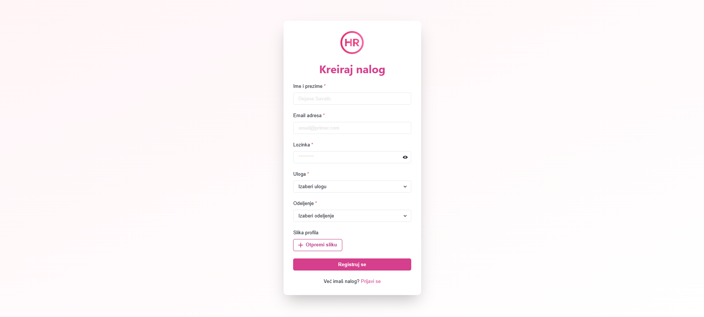

# HR App

**Full-stack web aplikacija** razvijena sa Laravel (backend) i React + Chakra UI (frontend) frameworkom. HR App omogućava jednostavno upravljanje korisnicima, zahtevima za odmor i evaluacijama zaposlenih, sa jasnom podelom uloge i prilagođenim prikazom za svaku od njih.

---

## Sadržaj

- [Pregled aplikacije](#pregled-aplikacije)  
- [Tehnologije](#tehnologije)  
- [Korisničke uloge](#korisničke-uloge)  
- [Glavne funkcionalnosti](#glavne-funkcionalnosti)  
- [Instalacija i pokretanje](#instalacija-i-pokretanje)  
- [Ekranske forme](#ekrans​ke-forme)  

---

## Pregled aplikacije

HR App je interni sistem za upravljanje kadrovskim procesima unutar kompanije:

1. **Autentikacija i registracija** korisnika (ime, email, lozinka, odeljenje, uloga, profilna slika).  
2. **Zaposleni** mogu da kreiraju, menjaju ili brišu svoje zahteve za odmor, prate status i pregledaju svoje ocene (performance reviews).  
3. **HR radnik** prima i obrađuje zahteve za odmor zaposlenih — odobrava ili odbija, i prati stanje svih zahteva dodeljenih njima.  
4. **Administrator** kontrolše sve korisnike i odeljenja, briše naloge, i dobija metrike o broju zaposlenih po odeljenjima.

---

## Tehnologije

- **Backend**: [Laravel 10](https://laravel.com/) (PHP 8+)  
  - Sanctum za autentikaciju putem API tokena  
  - Eloquent ORM za rad sa modelima: `User`, `Role`, `Department`, `LeaveRequest`, `PerformanceReview`  
  - Resursi (JSON Resources) za uniforman API output  
- **Frontend**: [React 18](https://reactjs.org/) + [Chakra UI](https://chakra-ui.com/)  
  - React Router za navigaciju  
  - Axios za HTTP pozive  
  - Chakra moduli za tabele, kartice, modale, forme i rasporede  
- **Baza podataka**: MySQL / MariaDB  
- **Ostalo**: Docker (opciono), Git, Composer, npm/yarn

---

## Korisničke uloge

1. **Neulogovani korisnik**  
   - Može da se registruje i prijavi.  
   - Nema pristup zaštićenim delovima aplikacije.

2. **Zaposleni (Employee)**  
   - Kreira i menja svoje zahteve za odmor.  
   - Pregled svojih performansi (ocene i komentari).  
   - Ne vidi tuđe zahteve.

3. **HR radnik (HR Worker)**  
   - Pristup listi zahteva dodeljenih njima.  
   - Odobrava ili odbija pendin­g zahteve.  
   - Može da briše sopstvene ili tuđe zahteve unutar svoje nadležnosti.

4. **Administrator (Admin)**  
   - Upravljanje korisnicima: pregled, brisanje naloga (osim sopstvenog).  
   - Pregled broja zaposlenih po odeljenjima (grafik metrike).  
   - Pristup svim API endpoint-ima.

---

## Glavne funkcionalnosti

- **Autentikacija & autorizacija**: Sanctum + React context za čuvanje tokena.  
- **CRUD zahtevi za odmor**:  
  - Zaposleni kreiraju/uređuju/brišu vlastite zahteve.  
  - HR radnik ažurira status (`pending → approved/rejected`).  
- **Performance reviews**:  
  - Zaposleni pregledaju liste i detalje svojih ocena.  
  - Mogućnost eksportovanja u PDF.  
- **Administracija korisnika**:  
  - Pregled svih korisnika, filtriranje po rolama (izuzimajući admin).  
  - Brisanje naloga.  
- **Dashboard**:  
  - Za administratora: bar chart sa brojem zaposlenih po odeljenjima, carousel novozaposlenih, KPI kružni grafikoni.  
  - Za zaposlenog i HR radnika: personalizovani pregled: krug-grafik, lista rođendana, welcome kartica.

---

## Instalacija i pokretanje
---------------------------

1. Klonirajte repozitorijum:
```bash
    git clone https://github.com/elab-development/internet-tehnologije-2024-projekat-hrapp_2021_0294_2021_0036.git
```
2. Pokrenite backend:
```bash
   cd hr-app
   composer install
   php artisan migrate:fresh --seed
   php artisan serve
```
    
3. Pokrenite frontend:
```bash
   cd hr-app-front
   npm install
   npm start
```
    
4.  Frontend pokrenut na: [http://localhost:3000](http://localhost:3000) Backend API pokrenut na: [http://127.0.0.1:8000/api](http://127.0.0.1:8000/api)

---

## Ekranske forme

- **Login**  
  Formular za prijavu (email, lozinka) sa stilizovanom karticom i dugmetom „Prijavi se“.
  

- **Register**  
  Formular za kreiranje naloga (ime i prezime, email, lozinka, uloga, odeljenje, profilna slika) u centralnoj kartici.
  

- **Home Dashboard**  
  Personalizovani pregled za svaku ulogu:  
  - Krug-grafik i bar-grafik (“Personal Overview”)  
  - Welcome kartica sa profilnim podacima  
  - Carousel za rođendane ili novozaposlene
    

- **Leave Requests (Employee)**  
  Kartični prikaz svih sopstvenih zahteva za odmor sa statusima (Pending / Approved / Rejected), dugmadima **Update** (za pending) i **Delete**, i modali za kreiranje i izmenu zahteva.
    

- **Leave Requests for you (HR Worker)**  
  Kartični prikaz zahteva dodeljenih HR radniku, sa dugmadima **Approve** i **Reject** na pending zahtevima.
    

- **All Users (Admin)**  
  Tabela svih korisnika (osim admina) sa kolonama: Avatar, ID, Name, Email, Role, Department, Actions.  
  Panel sa pretragom po imenu, filterom po roli, sortiranje po ID/alfabetu i paginacijom (5 po strani), dugme **Delete** za svaki red.
    

- **My Performance Reviews (Employee)**  
  Tabelarni prikaz sopstvenih ocena (ID, Reviewer, Department, Score, Created At) sa dugmadima **View** i **PDF**.
    

- **Performance Reviews (HR Worker)**  
  Tabela svih ocena sa dodatnim dugmetom **Edit** i modalom za kreiranje/izmenu, plus **PDF** export.
    

- **Global Corporation Map**  
  Leaflet/OSM interaktivna mapa sa pink/gray slojem i tamnocrvenim granicama zemalja, 12 nasumičnih markera, pop-up “Corporation {City}” sa informacijama o gradu, državi i broju zaposlenih.
    
